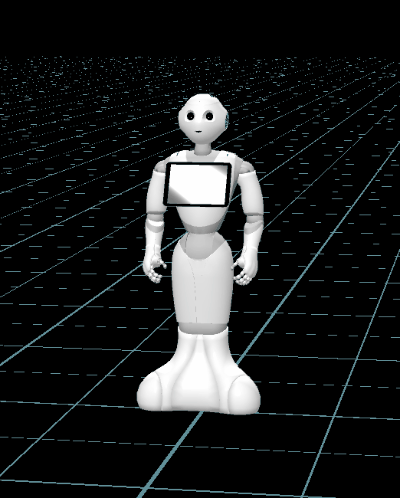
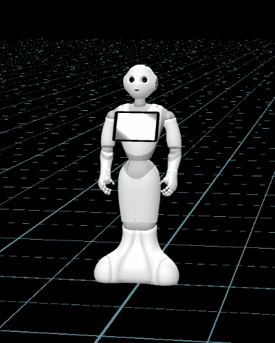
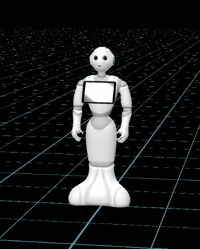

# Orientation Animations

This is a set of animations for Pepper the robot, using the QiSDK, allowing Pepper to point in various directions.

See https://developer.softbankrobotics.com/pepper-qisdk

## Usage

Import the animations into your Android project, for more details see
[here](https://developer.softbankrobotics.com/pepper-qisdk/api/motion/tutorials/mimic-animal-animate)
for explanations on running animations.

## List of animations

The animations can be categorized by:

 * Is the point nearby or distant?
 * Is it on Pepper's left or right? (only the left side examples are shown in the gifs below)
 * At which angle is it? Front, Medium (around 45°) or Half (around 90°)

For angles beyond 90° it's best to make Pepper's base turn a bit so as to point in the right place;
that also be done when pointing forward if you want to point at a very specific angle.

### For nearby points

|    | Left | Right |
|----|------|-------|
| Front  | PointShortFrontL.qianim   | PointShortFrontR.qianim   |
| 45°    | PointShortMediumL.qianim  | PointShortMediumR.qianim  |
| 90°    | PointShortHalfL.qianim    | PointShortHalfR.qianim    |

Front:

Medium:

Half:

### For distant points

|    | Left | Right |
|----|------|-------|
| Front  | PointFrontL.qianim   | PointFrontR.qianim   |
| 45°    | PointMediumL.qianim  | PointMediumR.qianim  |
| 90°    | PointHalfL.qianim    | PointHalfR.qianim    |

Front:

Medium:

Half:

